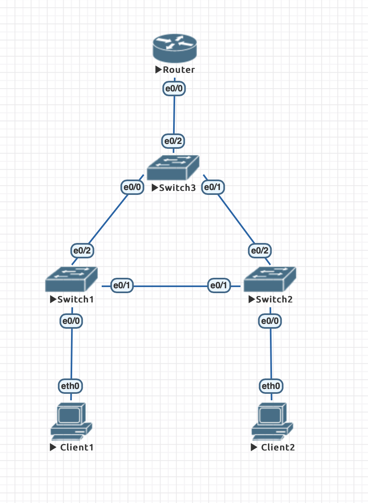
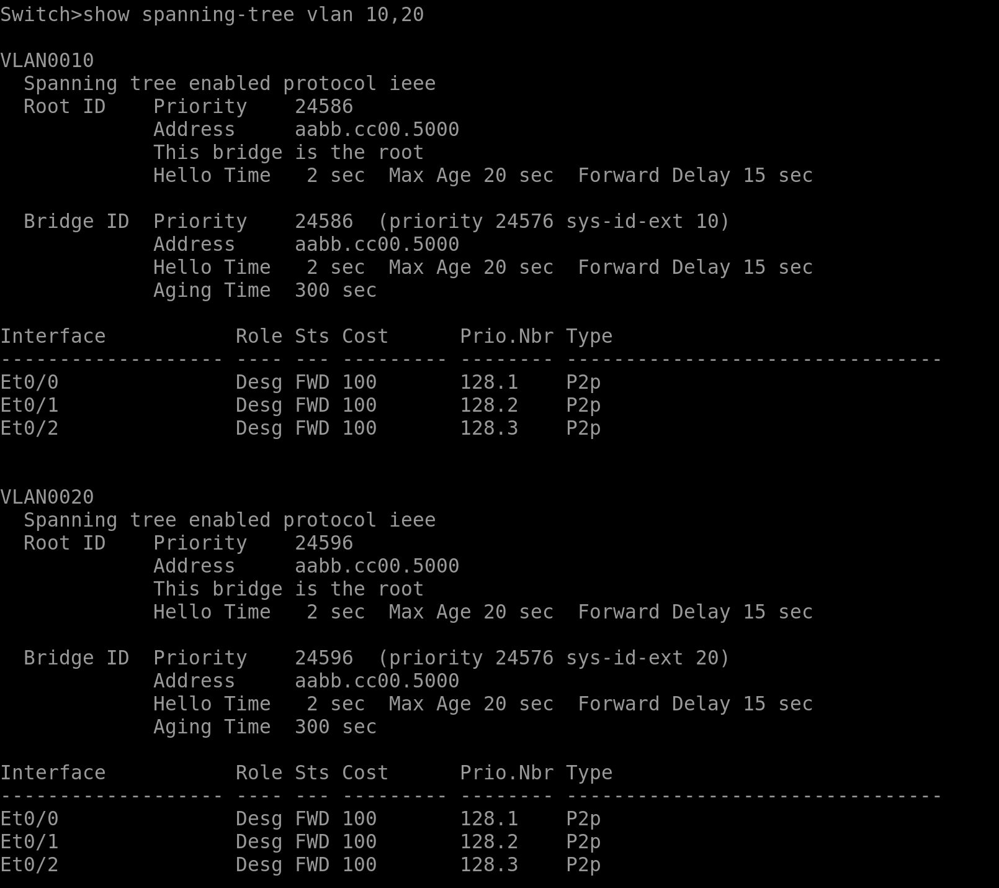
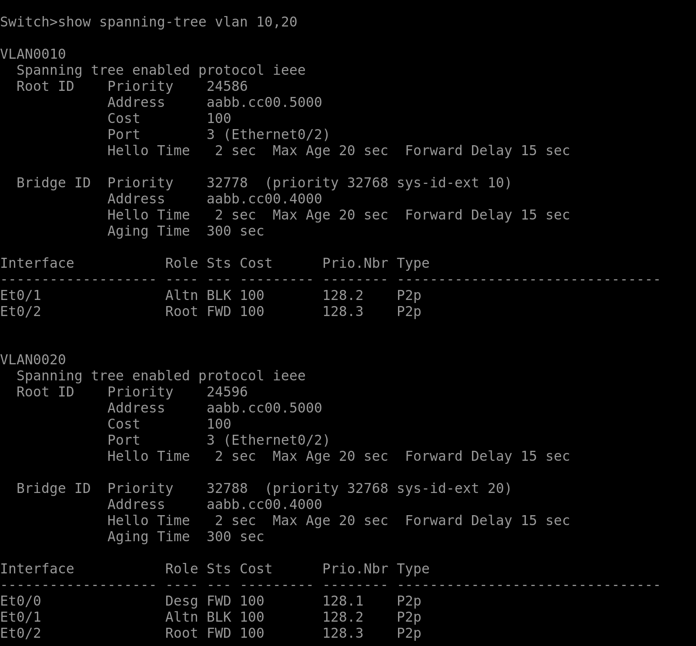
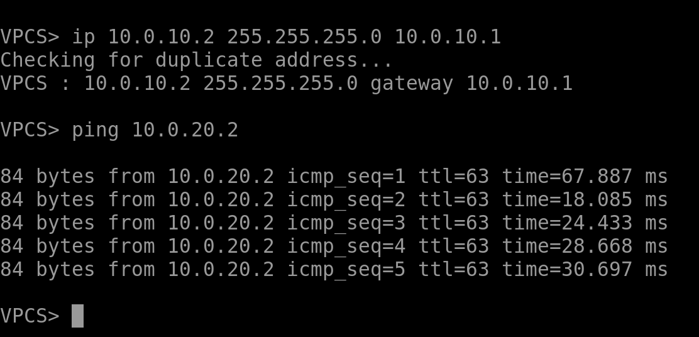
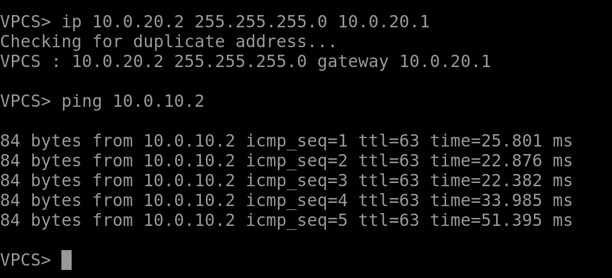

# Реализация небольшой сети офиса

Конфигурации можно посмотреть в папке [node-configs](node-configs). Также прикладываю лабораторную [hse-lab1.unl](hse-lab1.unl).

- Собрала сеть с такой топологией:
<!--  -->

- Настройки vlan можно посмотреть в конфигах.
- Здесь на левой картинке видно, что коммутатор уровня распределения (switch3) является корнем для обоих vlan, а на правой картинке - скрин с терминала switch2, на котором видно, что соединение между коммутаторами уровня доступа заблокировалось в результате работы протокола STP.

 

- Пинги от client1 к client2, и наоборот:

 
