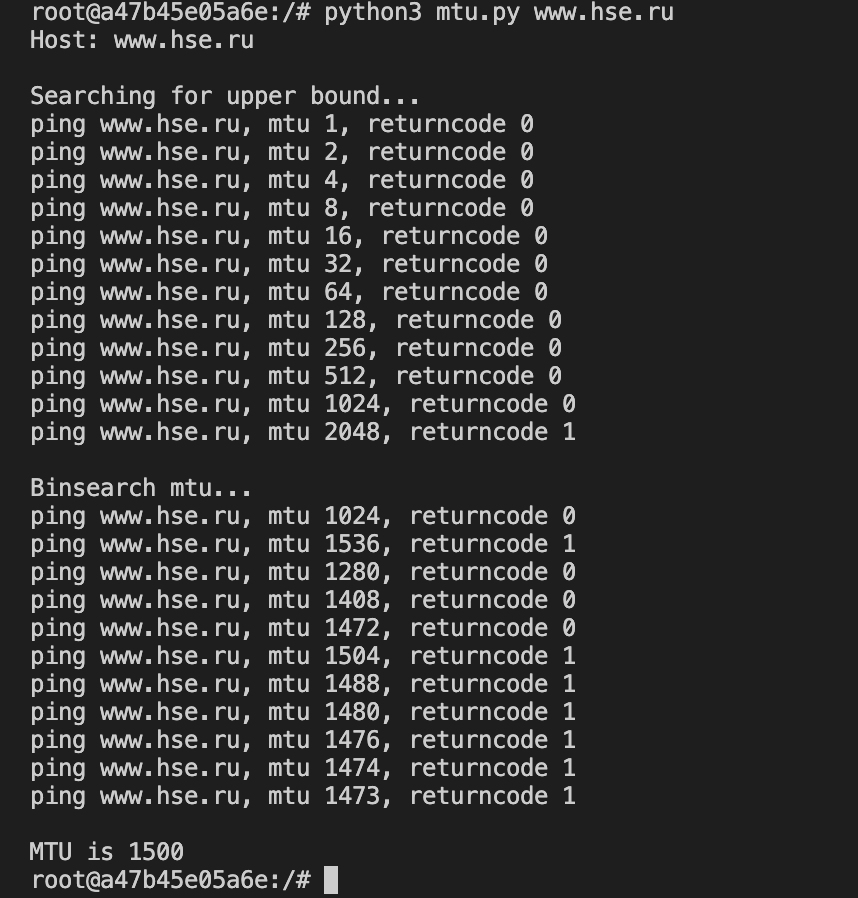
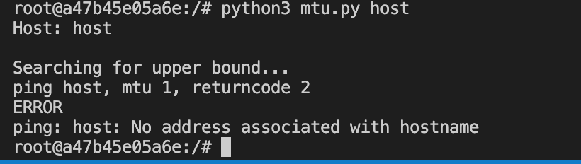

# Реализация скрипта для тестирования MTU в канале

# Алгоритм
Пингуем хост со специальной опцией, чтобы он отсылал все одним пакетом, и выставляем, сколько байт хотим отправить. Тогда по возвращаемому коду понимаем, была ли ошибка из-за превышения MTU или какая-то другая.

С помощью операции, описанной выше, сначала ищем верхнюю границу MTU - сколько байт точно считается его превышением - постепенно увеличивая размер отправляемого пакета. Далее обычным бинпоиском ищем максимальный возможный размер пакета.

При ошибках, не связанных с превышением MTU, завершаем программу с ненулевым кодом и выводим то, что вывел ping.

Проверялось на macos и в докере linux.

# Запуск
```
# Локально
# Из директории lab2
python3 mtu.py HOST
```

```
# В докере
# Из директории lab2
docker build -t mtu .
docker run -i -t mtu
python3 mtu.py HOST
```

# Пример работы



# Пример работы при ошибке: невалидный хост

