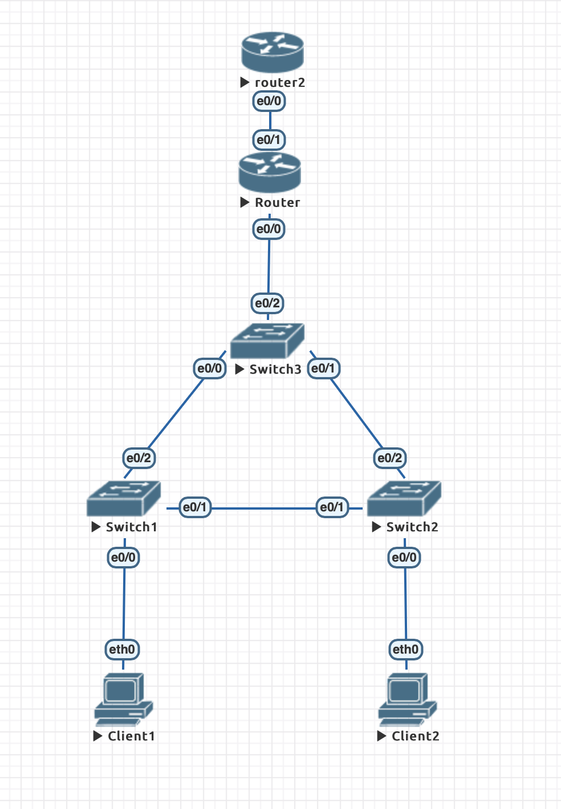
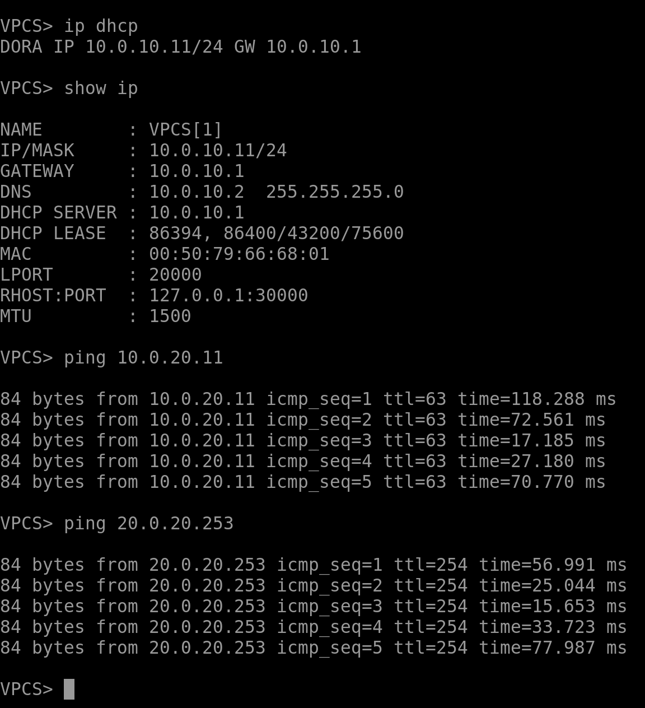
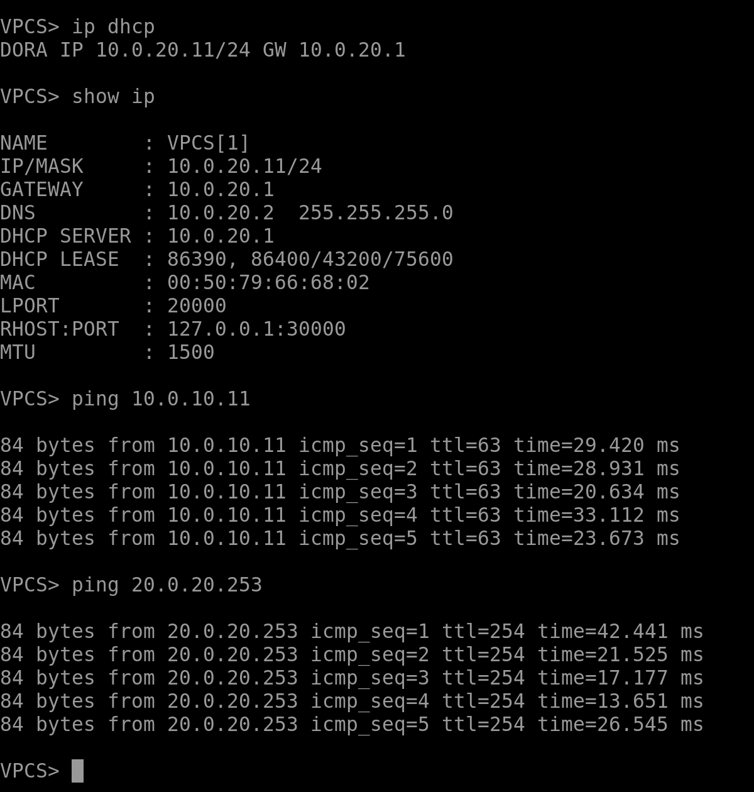

# Модернизация сети офиса из задания 1

Конфигурации можно посмотреть в папке [node-configs](node-configs). По сравнению с лабораторной 1 в конфигах изменились настройки router, и добавился router2. Также прикладываю лабораторную [hse-lab3.unl](hse-lab3.unl).

- Собрала сеть с такой топологией:

- Настройки dhcp и nat можно посмотреть в конфиге [node-configs/router](node-configs/router).

- Запрашиваем ip адрес у dhpc для client1 и client2. Пинг от client1 к client2, и наоборот. А также пинги от клиентов к верхнему роутеру (router2):

 
