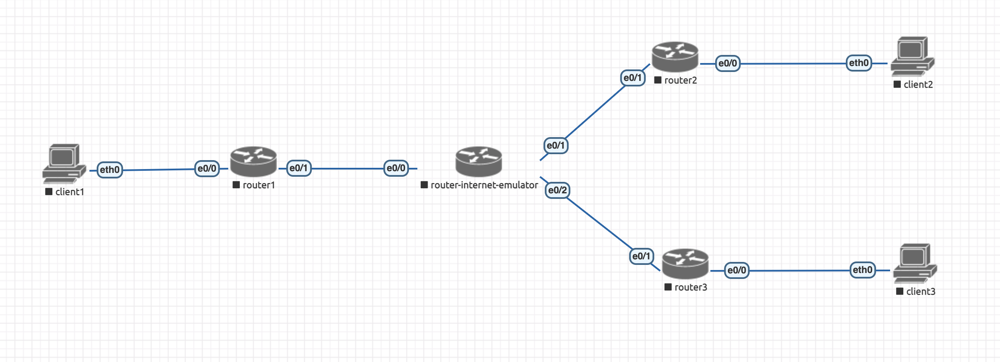
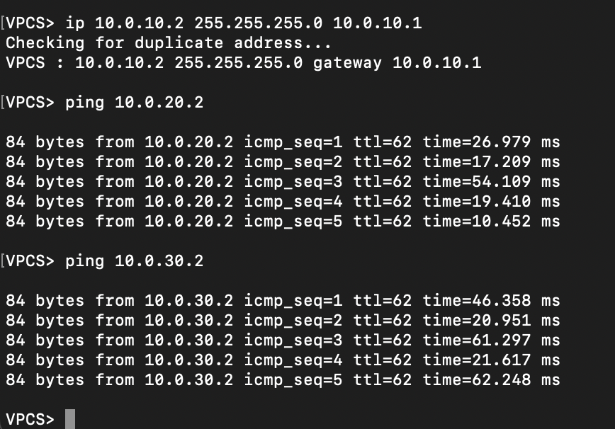
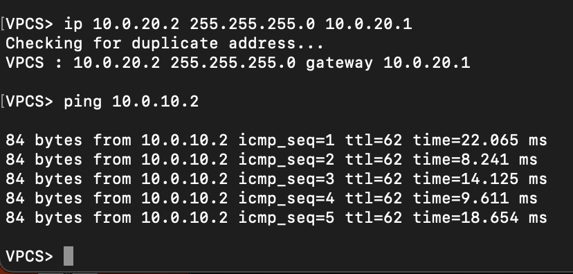
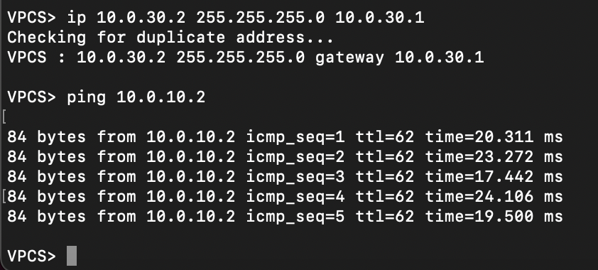
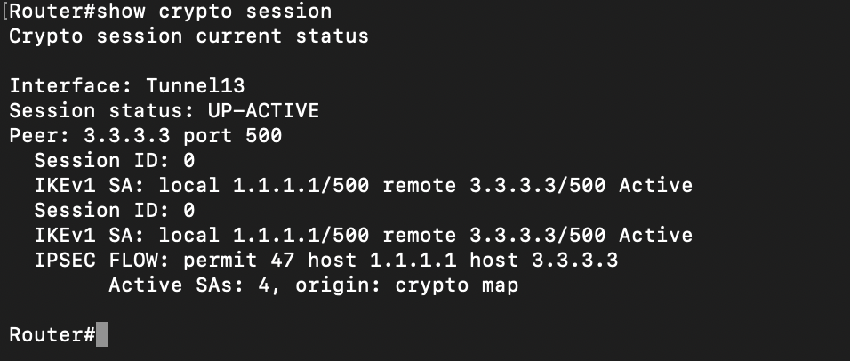

# Построение VPN тоннелей между офисами

Конфигурации можно посмотреть в папке [node-configs](node-configs). Также прикладываю лабораторную [hse-lab4.unl](hse-lab4.unl).

- Собрала сеть с такой топологией:

- Пинги по тоннелям видно здесь:

 

- show crypto session на router1:

